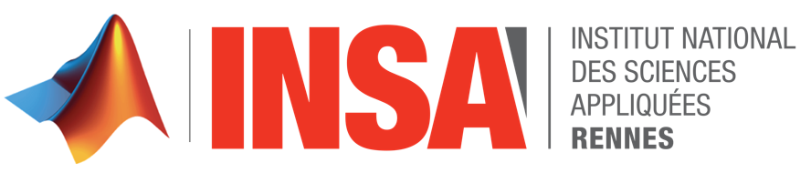
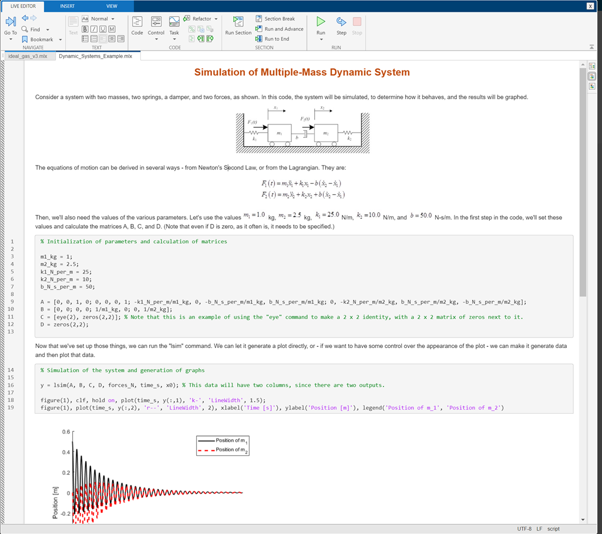

# Maîtriser MATLAB

# Bonnes pratiques et outils avancés pour la recherche

INSA Rennes \- June 13, 2025

|||
| :-- | :-- |
|     | **Modern MATLAB and Coding Best Practices**   MATLAB Projects    [From scripts to Live Scripts](./1.Coding_Best_Practices/2.Pyramid_Number/slow_code.m)   Code profiling and optimization    Integration with GitHub, GitHub Actions and CI/CD Pipelines   Integration with VSCode and Jupyter     |
|        | **MATLAB + Python**   [Call Python from MATLAB](./2.MATLAB_with_Python/1.Weather-Analysis/CallPythonFromMATLAB.mlx)   Call MATLAB from Python   Generate Python packages     |
|     | **Generate, deploy and share you code**   Work with MATLAB and non\-MATLAB peers   [Create HMI and Apps with AppDesigner](./3.Apps_Codegen_Deployment/1.App_Building/Monte_Carlo_Pi.mlx)   [Generate C/C++ code and executables](./3.Apps_Codegen_Deployment/2.Code_Generation/GenerateCodeForComputePi.mlx)     |

## Contacts

[**Daniele Sportillo**](https://www.linkedin.com/in/danielesportillo) \[[dsportil@mathworks.com](mailto:dsportil@mathworks.com)\]

